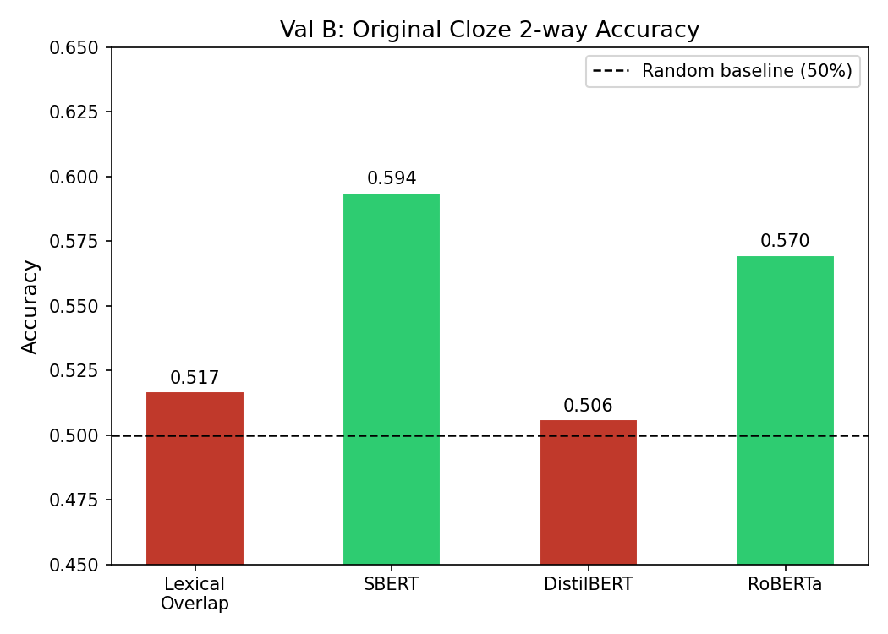
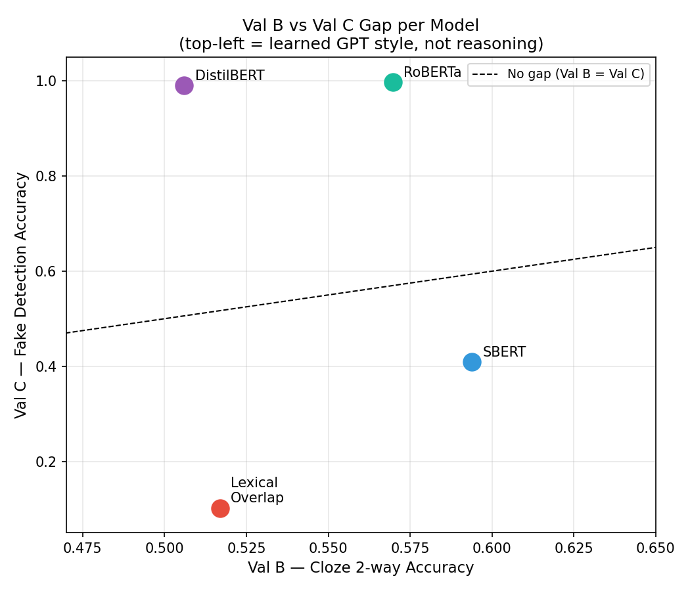

# Beyond Answer Generation: Diagnosing Narrative Reasoning in Transformers

**Author:** Nitya Sree Cheera  
**Course:** NLP Final Project | April 2026

## Abstract

We study whether language models truly understand short stories, or whether they just pick up on simple patterns. Using the ROC Stories dataset and the Story Cloze Task, we created four types of wrong story endings — ones that break time order, cause-effect logic, world facts, or emotional tone — using GPT-4o-mini. We tested four models: a word-count baseline, Sentence-BERT (SBERT), and two fine-tuned models (DistilBERT and RoBERTa). We found that the Story Cloze dataset has weak surface-level clues that slightly help simple models. Our main finding is a large gap: fine-tuned models scored up to 99.7% at detecting AI-generated fake endings, but only 50–59% on the real human-written Story Cloze test. This shows the models learned to recognize GPT's writing style, not actual story logic. RoBERTa did slightly better, reaching 57.0% on the real task. Time-order reasoning was the hardest type across all models.

## 1. Introduction

The Story Cloze Task asks a model to pick the correct ending to a four-sentence story from two options. Modern language models do well on this task, but it is not clear if they actually understand the story or just rely on patterns like word overlap or tone.

This project takes a closer look. Instead of just measuring accuracy, we ask: what kinds of reasoning do models actually use? We created four types of wrong endings and tested whether models could tell them apart from the right one.

**Research questions:**
1. What simple patterns exist in the Story Cloze dataset?
2. Can models tell apart real endings from AI-generated fake ones?
3. Do models that do well on fake detection also do well on the real task?
4. Which type of wrong ending is hardest to detect?

## 2. Exploratory Data Analysis

### 2.1 Dataset Overview

| Dataset | Size |
|---------|------|
| ROC Stories (full) | 52,665 stories |
| ROC Stories (used, after filtering) | 4,841 stories |
| Story Cloze Validation Set | 1,571 stories |

Each ROC story has five sentences. Sentences get slightly longer toward the end (7.7 words on average for sentence 1, up to 9.1 for sentence 5). The Story Cloze dataset is balanced: the first ending is correct about 51% of the time.

### 2.2 Shallow Signal Analysis

**Experiment 1 — Word Overlap:**  
Correct endings share slightly more words with the story context (0.447 on average) than wrong ones (0.435). But the correct ending has higher overlap only 46% of the time. A simple word-overlap model gets only **51.9%** accuracy — barely better than guessing.

**Experiment 2 — Sentiment:**  
A model that picks the ending closer in tone to the story gets **59.8%** accuracy. This works because some wrong endings have an obvious tone mismatch. But it is not true reasoning.

**Experiment 3 — Hard Sentiment Cases:**  
We looked at 390 stories (24.8%) where both endings had similar tone. On this group, the sentiment model dropped to **51.3%** — back to chance. This confirms that tone matching is a shortcut, not a reasoning skill.

### 2.3 Feature Comparison Table

| Feature | Correct Mean | Wrong Mean | Difference |
|---------|-------------|------------|------------|
| Ending word count | 7.59 | 7.32 | +0.26 |
| Lexical overlap | 0.447 | 0.436 | +0.012 |
| Jaccard similarity | 0.102 | 0.098 | +0.005 |
| New entity count | 0.255 | 0.192 | **+0.064** |
| Has pronoun | 62.8% | 57.7% | +5.1% |
| Has temporal cue | 15.0% | 9.8% | **+5.2%** |
| Has negation | 3.6% | 9.2% | **−5.6%** |

Correct endings tend to add new details and time cues, which is natural in a story. Wrong endings use negation much more (9.2% vs 3.6%), suggesting they were written as simple opposites. Overall, the differences are small and not reliable enough to classify well.

**Summary:** The Story Cloze task has weak surface clues. Models need to understand the actual story to do well.

## 3. Data Generation

### 3.1 Creating Wrong Endings with GPT-4o-mini

We used **GPT-4o-mini** to write one wrong ending per story for each of four categories. Each prompt told the model to:
- Keep the same characters, setting, and topic
- Write one clear, natural sentence
- Break only the target rule
- Not add new characters or places
- Not mix up the categories

| Type | What it breaks |
|------|----------------|
| **Temporal** | Time order — events happen too early, too late, or out of sequence |
| **Causal** | Cause and effect — the outcome does not match what caused it |
| **State** | World facts — contradicts something already established in the story |
| **Sentiment** | Emotional tone — the ending feels emotionally wrong for the story |

### 3.2 Quality Filtering

We filtered out bad outputs using three rules: (1) length between 4 and 25 words, (2) single sentence only, (3) not identical to the real ending.

| Stage | ROC Stories | Cloze Val |
|-------|------------|-----------|
| Raw generated rows | 20,240 | 6,284 |
| Failed length filter | 211 | — |
| Failed sentence filter | 24 | — |
| **Final clean rows** | **19,364** | **6,284** |
| **Stories retained** | **4,841** | **1,571** |

No generation errors were recorded.

## 4. Models

### 4.1 Baseline: Lexical Overlap

This model counts how many words the story context and each ending share. It picks the ending with more shared words. No training or weighting is used.

### 4.2 Sentence-BERT (SBERT)

SBERT (`all-MiniLM-L6-v2`) turns text into number vectors that capture meaning. It picks the ending whose meaning is closest to the context. No training needed.

### 4.3 Pairwise DistilBERT

We fine-tuned `distilbert-base-uncased` to compare two endings at once and pick the correct one. Input format: `[context] [SEP] [ending_a]` vs `[ending_b]`. We trained for 3 epochs, batch size 16, learning rate 2e-5.

### 4.4 Pairwise RoBERTa

Same setup as DistilBERT but using `roberta-base`, which was trained on more data. Generally stronger at comparing sentence pairs.

### 4.5 Data Splits

| Split | Source | Size | Purpose |
|-------|--------|------|---------|
| Train (80%) | ROC + GPT negatives | 3,872 stories / 15,488 pairs | Train DistilBERT and RoBERTa |
| Monitor (20%) | ROC + GPT negatives | 969 stories / 3,876 pairs | Early stopping |
| Val B | Cloze Val (human endings) | 1,571 stories | Real task accuracy |
| Val C | Cloze Val + GPT negatives | 1,571 × 4 types | Per-type fake detection |

## 5. Results

### 5.1 Val B: Real Story Cloze Accuracy

| Model | Val B Accuracy | p-value | Significant? |
|-------|---------------|---------|-------------|
| Lexical Overlap (Baseline) | 51.7% | 0.095 | No |
| SBERT | **59.4%** | < 0.001 | **Yes** |
| DistilBERT | 50.6% | 0.325 | No |
| RoBERTa | 57.0% | < 0.001 | **Yes** |

*One-sided binomial test against chance (50%), n = 1,571.*

SBERT scores highest on the real task. RoBERTa is the only fine-tuned model to clearly beat chance. DistilBERT scores near-chance even though it was trained on the task.

### 5.2 Val C: Fake Ending Detection by Type

| Model | Temporal | Causal | State | Sentiment | Overall |
|-------|----------|--------|-------|-----------|---------|
| Lexical Overlap | 6.6% | 9.5% | 11.3% | 13.4% | 10.2% |
| SBERT | 23.8% | 41.1% | 44.3% | 54.2% | 40.9% |
| DistilBERT | 99.3% | 99.8% | 98.6% | 98.8% | 99.1% |
| RoBERTa | **99.7%** | **99.9%** | **99.5%** | **99.7%** | **99.7%** |

### 5.3 Training Curves (Fine-tuned Models)

**DistilBERT:**

| Epoch | Train Loss | Val Loss | Val Acc |
|-------|-----------|----------|---------|
| 1 | 0.1230 | 0.0329 | 99.15% |
| 2 | 0.0267 | 0.0244 | 99.45% |
| 3 | 0.0109 | 0.0289 | 99.41% |

**RoBERTa:**

| Epoch | Train Loss | Val Loss | Val Acc |
|-------|-----------|----------|---------|
| 1 | 0.0768 | 0.0374 | 99.33% |
| 2 | 0.0156 | 0.0300 | 99.47% |
| 3 | 0.0039 | 0.0332 | 99.55% |

Both models learn very quickly and hit near-perfect accuracy on the training set. This suggests they found an easy signal rather than learning to reason about stories.

## 6. Analysis

### 6.1 The Val B vs Val C Gap — Main Finding

| Model | Val B | Val C | Gap (C − B) |
|-------|-------|-------|-------------|
| Lexical Overlap | 51.7% | 10.2% | −41.5% |
| SBERT | 59.4% | 40.9% | −18.5% |
| DistilBERT | 50.6% | 99.1% | **+48.5%** |
| RoBERTa | 57.0% | 99.7% | **+42.7%** |

DistilBERT and RoBERTa score over 99% at detecting GPT-generated fake endings, but only 50–57% on the real task. This means they learned to recognize how GPT-4o-mini writes, not how stories work. When tested on human-written alternatives, they fall apart.

RoBERTa's smaller gap (42.7% vs 48.5%) suggests it has slightly more general understanding built in from pretraining.

### 6.2 Which Reasoning Type is Hardest?

For the two models with no training (Lexical Overlap and SBERT), time-order errors were the hardest to catch and sentiment errors were the easiest:

| Model | Temporal Error | Causal Error | State Error | Sentiment Error |
|-------|---------------|-------------|------------|----------------|
| Lexical Overlap | **93.4%** | 90.5% | 88.7% | 86.6% |
| SBERT | **76.2%** | 58.9% | 55.7% | 45.8% |

Time-order errors are hard because you need to track when things happen across multiple sentences. Sentiment errors are easier because emotional words appear directly in the text.

### 6.3 Error Examples

Here are examples of wrong endings that fooled the Lexical Overlap model:

**Temporal** — events in the wrong order:
> *Context:* "Laverne follows a brownie recipe closely. She tests one brownie."  
> *Real ending:* "The brownies are so delicious Laverne eats two of them."  
> *Fake ending:* "Laverne tests one brownie **after she has already eaten all of them**."

**Causal** — outcome does not follow from the story:
> *Context:* "John and Billy won a beer pong contest. The next level sent them to Vegas."  
> *Real ending:* "In Vegas, they competed against eighty contestants."  
> *Fake ending:* "In Vegas, they **decided to quit beer pong and take up professional knitting**."

**State** — contradicts a fact set up in the story:
> *Context:* "Ron finishes landscaping the mayor's yard early and is ecstatic."  
> *Real ending:* "His boss commends him for a job well done."  
> *Fake ending:* "His boss **is unhappy and fires Ron on the spot**."

## 7. Discussion

The key problem we found: when the training data and the test fake endings both come from the same AI (GPT-4o-mini), the model just learns GPT's writing patterns. It does not actually learn story logic. The gap between Val B and Val C scores shows this clearly.

RoBERTa does a bit better on the real task (57%), but the large gap shows it still relies on style matching. The most honest result comes from SBERT: 59.4% on the real task without any fine-tuning. This shows that good sentence representations can help even without task-specific training.

## 8. Conclusion

We built a framework to test how well models handle four types of story errors. Fine-tuned models scored nearly perfectly on AI-generated fake endings but barely above chance on real human-written ones. This means they learned GPT's writing style, not story reasoning. SBERT and RoBERTa were the only models to clearly beat chance on the real task. Time-order reasoning was the hardest type across all models. Future work should use human-written fake endings and test models trained on one AI's output on another AI's output, to separate style from reasoning.

## Appendix A: Additional Baselines

### A.1 Model 2 — TF-IDF Cosine Similarity

This model turns the story context and each ending into weighted word vectors using TF-IDF. It picks the ending whose vector is closest to the context. No training is needed.

**Results:**
- Val B: 51.7% (p = 0.095, not significant)
- Val C: Temporal 31.0%, Causal 48.0%, State 47.4%, Sentiment 55.3%, Overall 45.4%
- Only sentiment is statistically significant (p < 0.001)

### A.2 Model 3 — TF-IDF + Logistic Regression

A classifier trained to tell correct endings from wrong ones using TF-IDF features.

**Results:**
- Train accuracy: 90.6% (30,976 pairs)
- Monitor accuracy: 80.4% (7,752 pairs)
- Val B: 59.3% (significant, p < 0.001)
- Val C: Temporal 98.3%, Causal 97.7%, State 96.1%, Sentiment 97.3%, Overall 97.4%

This model shows the same Val B vs Val C gap as the transformer models. Even a simple classifier can learn GPT's writing style.

## Appendix B: Full Results Table

| Model | Val B | C-Temp | C-Causal | C-State | C-Sent | C-Overall |
|-------|-------|--------|---------|--------|-------|----------|
| Lexical Overlap | 51.7% | 6.6% | 9.5% | 11.3% | 13.4% | 10.2% |
| TF-IDF Cosine | 51.7% | 31.0% | 48.0% | 47.4% | 55.3% | 45.4% |
| TF-IDF + LR | 59.3% | 98.3% | 97.7% | 96.1% | 97.3% | 97.4% |
| SBERT | 59.4% | 23.8% | 41.1% | 44.3% | 54.2% | 40.9% |
| DistilBERT | 50.6% | 99.3% | 99.8% | 98.6% | 98.8% | 99.1% |
| RoBERTa | 57.0% | 99.7% | 99.9% | 99.5% | 99.7% | 99.7% |
